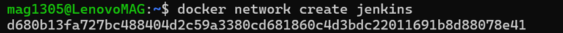
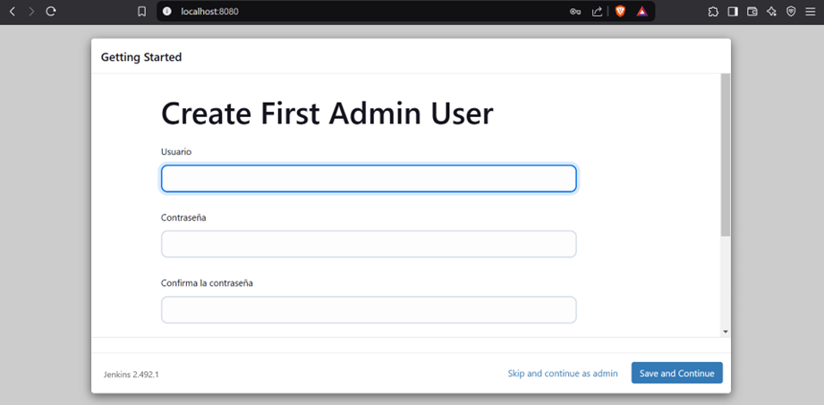

# **Docker-Jenkins Workshop Report**

## **Miguel Gonzalez - A00395687**

## **First part: Jenkins installing and configuring**

It is necessary to create a network to communicate the jenkins container with the agent container:

```sh
docker network create jenkins
```



---

Now we create a new dockerfile where we leave the parameters to start the jenkins container:


---

We use the `docker build` command to create the image from the dockerfile:


---

Once the image has been created, we start a new container with this image, specifying also the network that was created in the first step:


---

Now we just go to the browser and access the link `localhost:8080`:


---

There are many methods to obtain the jenkins admin panel password. In my case, I decided to get it through the jenkins-ocean container logs:


---

Once the password has been obtained, all that remains is to install the recommended puglins and update the parameters to access the panel:





---

## **Second part: Our first agent**

First, an ssh key is created to establish a security layer with respect to the agents that can connect:


This key must now be added in the jenkins security panel:


Es necesario consultar la llave privada que creamos, esto se puede hacer con un comando `cat`.

---

Now we must create the container that will hold our agent. First we must consult the ssh public key:


The container is then created, but it is important to note that the ssh key must be complete and that the `--network ` parameter must be added to set the container on the network that was created at the beginning:

```sh
docker run -d --rm --name=agent1 --network jenkins -p 22:22 -e "JENKINS_AGENT_SSH_PUBKEY=ssh-ed25519 AAAAC3NzaC1lZDI1NTE5AAAAIIfTyPvzNlZQ6HYrqTan8lIdpZNscZoQhYTrqc1ozC9p mag1305@LenovoMAG" jenkins/ssh-agent:alpine-jdk17
```

We can remove the `-rm` parameter since it deletes the container every time the docker service is stopped.


---

The agent must now be linked to the panel. It is important to highlight two things, you must assign an existing directory and in host you must put the name assigned at the time of creating the container, in my case `agent1`:


---

We check the agent status in the panel:


## **Third part: Assigning tasks to the agent**

### **Running a Github + Maven project**

Select “new task” and choose pipeline. When we configure the script a drop-down menu will appear from where we can select “Github + Maven”:


The script will appear by cloning to the repository 'https://github.com/jglick/simple-maven-project-with-tests', which has the branches to perform the following points.


An error appears, saying that maven is not configured in jenkins:


Quickly go to “manage jenkins -> tools”. Here, we will be able to add the maven dependency, that once selected we will save and that's it:


Now, we can execute the job:


### **Running task in a choosed branch**

For this we must modify the previous script adding a new parameter that will be the name of the branch:


Now when we modify the task, we will have a new entry, since jenkins detects this change automatically:


Finally, just execute it:


### **Script in a file**

First you must locate in which folder the jenkins workspace is saved. Once located we add a new file `build_script.groovy` and paste the script here:


We modify the script in the panel, to execute the script in the file:


And again, we execute:


---
