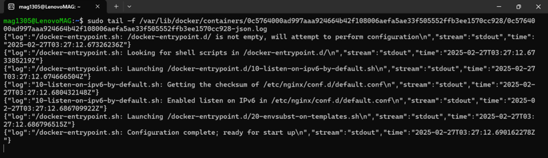

# **Docker Workshop Report**

## **Miguel Gonzalez - A00395687**

## **1. Run a hello world container.**

To run a hello-world container, use this command:

```sh
docker run nginx:1.18.0
```


---

## **2. Changing the storage driver by devicemapper driver.**

First, a new file is created where the daemon configuration is assigned:

```sh
sudo nano /etc/docker/daemon.json
```

Then add the new storage driver configuration:


The docker service is restarted with the following command:

```sh
sudo systemctl restart docker
```

Finally, the change is checked with:

```sh
docker info
```


---

## **3. Changing it back to overlay2.**

As in the previous point, we declare again the storage driver in daemon.json:


We reload the docker services and check:


---

## **4. Running an Nginx Container with a Specific Version**

To run an Nginx container with version 1.18.0, use the following command:

```sh
docker run nginx:1.18.0
```

This will pull the image (if not already downloaded) and run it.


We can observe the active containers with:

```sh
docker ps
```

And the active and innactive with:

```sh
docker ps -a
```


---

## **5. Running the Container in the Background**

To run the container in detached mode (background), add the `-d` flag:

```sh
docker run -d nginx:1.18.0
```

This allows the container to keep running without blocking the terminal.


---

## **6. Configuring the Nginx Container**

### **Naming, Restart Policy, Port Mapping, and Memory Limit**

To configure the container with a name (`nginx18`), restart policy (`on-failure`), port mapping (`443` → `80`), and memory limit (`250MB`), run:

```sh
docker run -d \
  --name nginx18 \
  --restart=on-failure \
  -p 443:80 \
  --memory=250m \
  nginx:1.18.0
```

- `-d`: Runs in the background.
- `--name nginx18`: Assigns a custom name.
- `--restart=on-failure`: Restarts only if the container fails.
- `-p 443:80`: Maps port 443 on the host to 80 inside the container.
- `--memory=250m`: Restricts memory usage to 250MB.


---

## **7. Checking the Current Logging Driver**

To check the logging driver used by the container, run:

```sh
docker inspect nginx18 --format='{{.HostConfig.LogConfig.Type}}'
```

This will return something like:

```
json-file
```

which is the default logging driver.


To find the logs route we use:

```sh
docker inspect --format='{{.LogPath}}' <container-name>
```


To access these logs in Json we use the command (in this example tail is used to avoid the over-exposition):

```sh
sudo cat -f <Json-route>
```



---

## **8. Changing the Logging Driver to `journald`**

To change the logging driver to `journald`, first stop and remove the existing container:

```sh
docker stop nginx18
```

```sh
docker rm nginx18
```

Then, recreate it with the `--log-driver=journald` option:

```sh
docker run -d \
  --name journald \
  --restart=on-failure \
  -p 443:80 \
  --memory=250m \
  --log-driver=journald \
  nginx:1.18.0
```

To verify the change:

```sh
docker inspect journald --format='{{.HostConfig.LogConfig.Type}}'
```

It should now return:

```
journald
```


If the container uses `journald`, check logs using:

```sh
journalctl CONTAINER_NAME=<container-name> --no-pager
```

To follow logs in real-time:

```sh
journalctl CONTAINER_NAME=<container-name> -f
```


---

## **Conclusion**

This workshop covered the use of multiple docker versions. How running, configuring, and managing an Nginx container in Docker, including logging options and container lifecycle commands. With these steps, you can effectively deploy and troubleshoot Dockerized applications.

---
